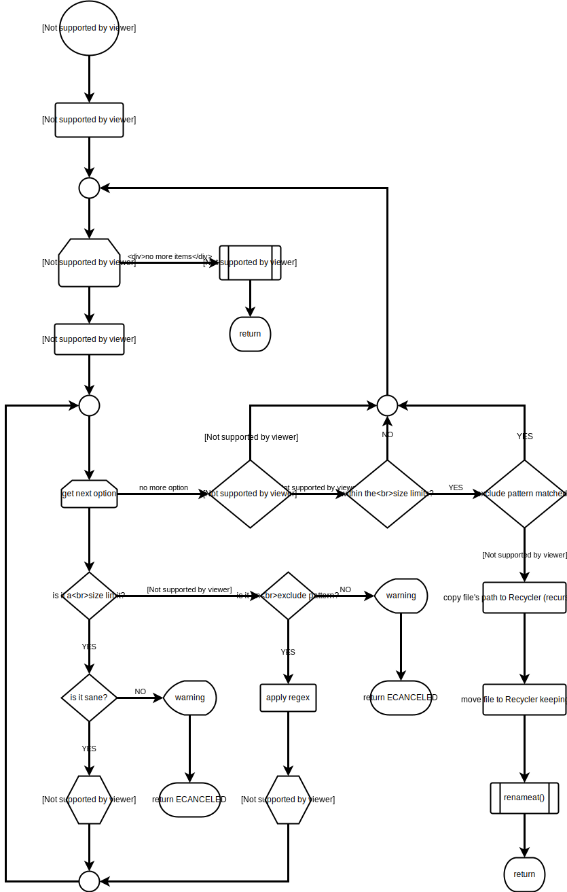

# LD_PRELOAD-able shared libraries for Linux

  * [autossl.so](#autosslso)
  * [recyclix.so](#recyclixso)


## autossl.so

`autossl.so` upgrades plaintext network sockets to SSL/TLS transparently
for TCP client applications with the help of external program. See
description and usage docs in the source file.


## recyclix.so

`recyclix.so` is an `LD_PRELOAD`-able shared library intercepting file deletions and
moving files to recycle bin (trash can) folder.

It can be configured via environment variable `RECYCLER`, whiches format is:

```
RECYCLER=<DIR>[,<SIZE_LIMIT>][,!<EXCLUDE_PATTERN>][:<DIR>[,<SIZE_LIMIT>][,!<EXCLUDE_PATTERN>][:<DIR>...]]
```

where `<SIZE_LIMIT>` is `<N><UNIT>[-<N><UNIT>]` indicating minimum and optional maximum file size which
recyclix saves; `<EXCLUDE_PATTERN>` is a regexp pattern which if matches to the file name, the file is ignored.
Multiple recycle bin definitions are supported, ideally one for each filesystem.
Examples:

```
RECYCLER='~/.Recycler,10M'
RECYCLER='~/Trash,100B-1G,!(\.bak|~)$'
RECYCLER='~/.Recycler,1k:/mnt/sdb/home/johndoe/.Recycler,!\.bak$,1k-100M:/var/deleted-files,!(\.bak|-)$'
```

### Behavior and limitations

It saves about-to-be deleted files in that recycle bin which is on the same filesystem (partition) as the file.
The file is not gonna be saved if there is no recycle bin on the filesystem according to `$RECYCLER`.
It keeps the file's path relative to the filesystem's mountpoint in the recycle bin too, so `/home/johndoe/src/xyz/file`
goes to `/home/johndoe/.Recycler/johndoe/src/xyz/file` provided that `/home` is the mountpoint. It overwrites
the file in the recycle bin if it already exists.

The following flow chart illustrates its inner working:



### Similar projects

- [libtrash](https://github.com/pete4abw/libtrash)


# Project issues, bugs, feature requests, ideas

1. clone the repo
2. use [git-bug](https://github.com/git-bug/git-bug) to open a new ticket in this repo
3. find one or more person in the commit history to make contact with, then either
4.a. send your newly created `git-bug` ticket (or patch if you already propose a code change) via email, or
4.b. send the URL of your git clone to a contributor (via email or other channel), and request them to pull (`git-bug` issues and/or branches as well) from you.
